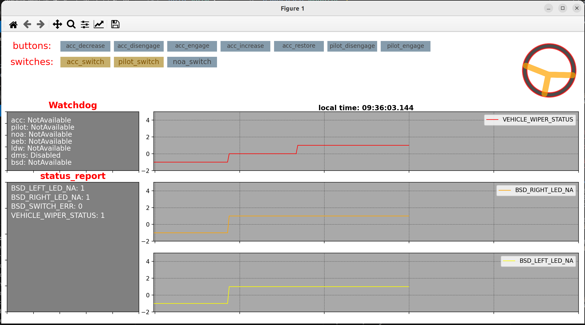
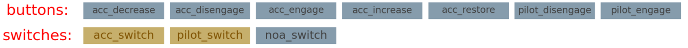
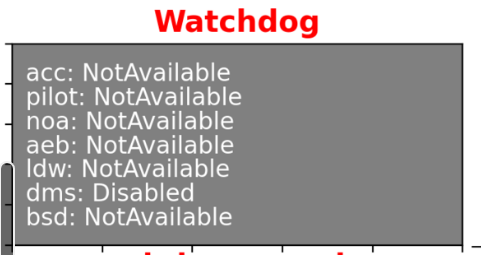
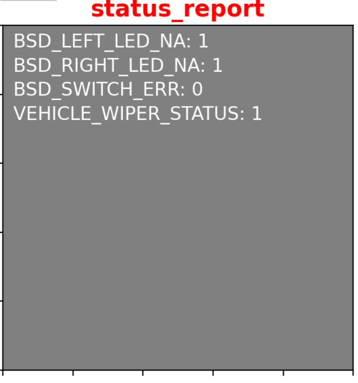
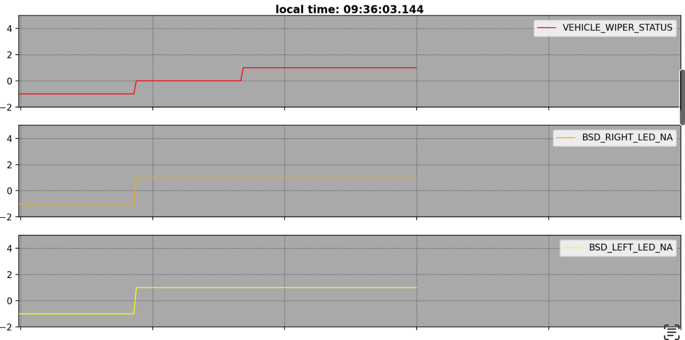
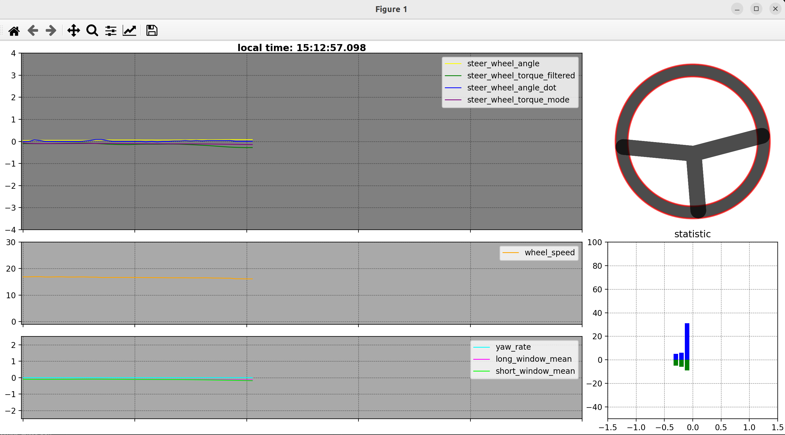
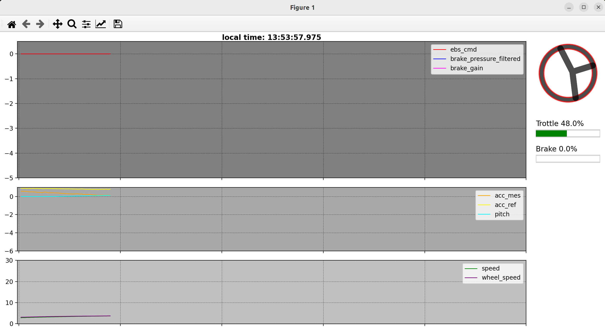
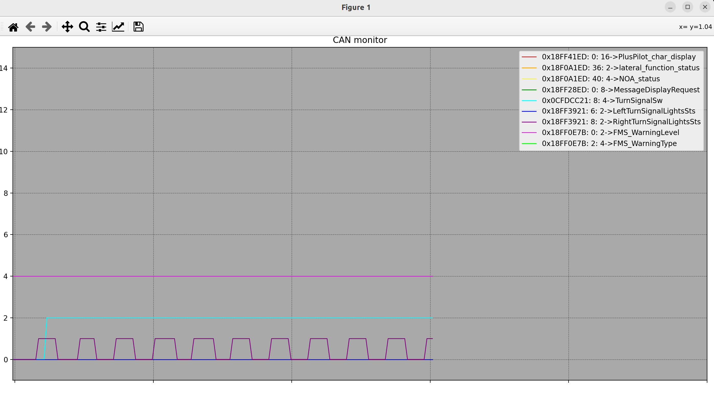
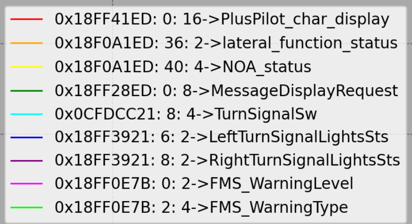
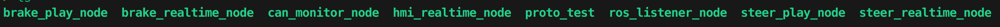

# ros topic可视化工具
## 1.HMI数据监控

### HMI显示功能介绍
hmi按键&大屏开关:未按下,图标为灰色,按下为黄色


watchdog状态(目前只加入了图标中的,后续需要可以再加入)


status_report对应topic内部变量状态(可以自定义)


数据曲线:


 <span style="color:red">Note:</span>
 - local time为程序运行时的系统时间
 - 曲线数据可以动态增加或者删减.


## 2.车辆横向状态监控


#### 目前监控的变量:
- <span style="color:green">adas状态方向盘颜色</span>
- <span style="color:green">方向盘状态:方向盘转角,角速度,扭矩</span>
- <span style="color:green">车辆状态:轮速,角速度</span>           
- <span style="color:green">学习算法数据:方向盘零偏扭矩学习结果</span>


## 3.车辆纵向状态监控


#### 目前监控的变量:

- <span style="color:green">车辆状态(反馈):速度,加速度,轮速,车辆姿态</span>
- <span style="color:green">控制数据:期望加速度,刹车期望</span>
- <span style="color:green">刹车状态:刹车压力....</span>
- <span style="color:green">刹车计算相关数据</span>

## 4.can报文监控
报文监视窗口


需要监视的报文

<span style="color:yellow">说明:can ID后面的第一个数字是需要查看信号的起始位,第二个数字是对应信号的长度,最后的文字信息为信号描述</span>

### 如何设置需要查看的报文:</span>
```C++
    PlotCanMsg plot_can01(0x18FF41ED,0,16,"PlusPilot_char_display");
    msg_parser.getCanSignal(plot_can01);
    plot_can_array.push_back(plot_can01);
```

#### step01:定义信号

- 其中PlotCanMsg结构体包含了需要查看信号对应的can ID,起始位和信号长度,最后的string信息自己可以到dbc中复制,然后粘贴在结构体定义的位置.

#### step02:获取信号值,更新结构体变量

- getCanSignal()函数用于获取解析信号对应的数值.

#### step03:放入带绘制变量容器

- 然后将更新后的PlotCanMsg类型的变量放入到需要绘制的变量容器中,就可以实现多个信号的绘制


## 5.使用教程
#### step01->下载docker镜像

```shell
docker pull docker.pluscn.cn:5050/plusai/dbw/ros-topic-monitor:test
```
#### step02->下载可视化程序

目前vehicle_nodes分支中的程序最好放到另一个文件夹中来使用

#### step03->使用脚本启动docker镜像
进入到/ros-noetic-docker文件夹,执行docker.sh脚本.根据后面是否加后缀,分为三种情况.
```shell
./docker run  //不加后缀 || host || 192.168.46.100
```
- 不加后缀:docker容器不与外部进行ros通讯
- 加host: docker容器订阅宿主机(本机)的ros master节点,可以监听到宿主机内部的ros topic信息.主要用于本地bag回放,然后使用可视化工具进行动态数据监控
- 加192.168.46.100:连接车上adu的ros master节点,用于订阅车上实时的topic数据

重新打开一个终端,执行以下的命令,实现新开docker容器窗口
```shell
./docker exec //无需后缀,用于已经开启docker容器后,继续新增窗口.
```
<span style="color:yellow">备注:
source ros路径等操作已经写入了shell脚本,无需自己操作 </span>

#### step04->本地程序编译
在程序对应的文件夹内(程序根目录),执行catkin_make,编译ros project

#### step05->运行编译程序
可执行程序

根据对应的程序名,可以调用不同的功能.(目前只要关注realtime相关的功能,play对应的功能用于数据回放,功能已经完善,有需要的再说.)

```shell
rosrun offline_ros brake_realtime_node brake_data
```
命令行解释:

brake_realtime_node为需要执行的程序,brake_data为数据记录(CSV数据)文件名定义,程序在监控数据的同时会实时记录csv数据.

不同功能解释:
- brake_realtime_node:刹车(车辆纵向)行驶数据监控
- can_monitor_node: can报文数据监控
- hmi_realtime_node: hmi数据监控
- steer_realtime_node: 横向数据监控

<span style="color:yellow">备注: 目前当前的命令执行需要设置一个文件名,如何后续用不到文件回放,可以去除这个后缀.</span>